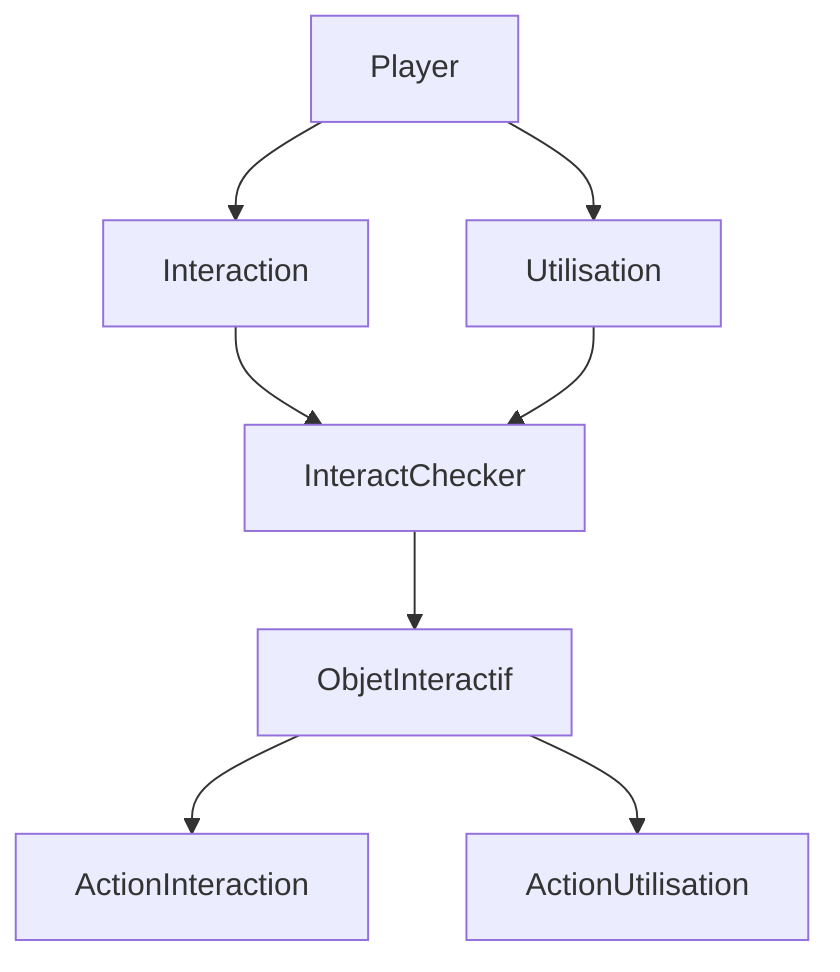

# Document Technique
## Architecture du projet
Ce projet et réaliser de manière modulaire qui sépare la logique de gameplay, les systèmes d'interaction, la physique et la présentation.

La structure principale est : 
- **Le joueur** : Il contient les mouvement du joueur, gérer les input et s'occupe des interaction spécifique au joueur.
- **Environnement** : Il contient les objets interactif et les élément des niveaux;
- **Système d'interaction** : Donne une interface commune pour détecter et interagir avec les différent objets
- **UI/Présentation** : Gère tous ce qui tien au élément de l'UI, Prompt et élément de feadback.

Cette séparation gardes les systèmes réutilisable et fait que chaque composent individuel soit plus simple à tester et a maintenir.

## Les Blueprints Principaux
### Le BP_Player
Dans le Player on y trouve les différent actions de base tel que le déplacement et la camera mais aussi la gestion de l'inventaire et l’apparition d’objet en main en fonction de la hotbar, l'initialisation du gestionnaire d'interaction et la fonction pour lancer des objets.

### Objet interactif
Il y a deux type d'objets interactif ceux qui peut être dans l'inventaire et ceux qui ne le peuvent pas, que ce soit l'un ou l'autre il sont tous liée a l'interface d'interaction, BPI_Interact, mais ceux qui peuvent être dans l'inventaire sont tous des enfant du BP_BaseItem ont une variable contenant les infos de l'item qui est créer avec la structure S_ItemInfo.

### Inventaire 
L'inventaire est un composant rattacher au joueur qui permet de vérifier le statut des objets quand on essaye dans rajouter un. La gestion des objets s'effectue via a une data base qui contient les infos de tous les objets et deux enumerateurs pour l'Id des Objet et pour le type.

### BP_InteractChecker 
Le gestionnaire d'interaction est une collision box qui suit une grille baser sur le joueur et vérifie si un objet doit réagir a un objet en main ou une simple interaction cela permettra d'avoir différent type d'interaction en fonction de la situation.

## Systeme d'interaction

## Système Physique
La seul fonction physique développer est le lancer d'objet fait avec un impulse. 

## Choix Technique Principaux

