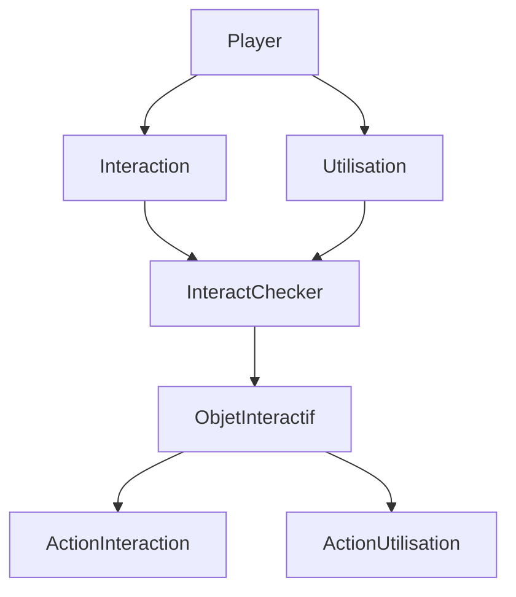

# Document Technique
## Architecture du projet
Ce projet est réalisé de manière modulaire, ce qui sépare la logique de gameplay, les systèmes d'interaction, la physique et la présentation.

La structure principale est : 
- **Le joueur** : Il contient les mouvements du joueur, gère les inputs et s'occupe des interactions spécifiques au joueur.
- **Environnement** : Il contient les objets interactifs et les éléments des niveaux.
- **Système d'interaction** : Donne une interface commune pour détecter et interagir avec les différents objets.
- **UI/Présentation** : Gère tout ce qui tient aux éléments de l'UI, aux prompts et aux éléments de feedback.

Cette séparation garde les systèmes réutilisables et fait que chaque composant individuel soit plus simple à tester et à maintenir.

## Les Blueprints Principaux
### Le BP_Player
Dans le Player, on y trouve les différentes actions de base telles que le déplacement et la caméra, mais aussi la gestion de l'inventaire et l'apparition d'objets en main en fonction de la hotbar, l'initialisation du gestionnaire d'interaction et la fonction pour lancer des objets.

### Objet interactif
Il y a deux types d'objets interactifs : ceux qui peuvent être dans l'inventaire et ceux qui ne le peuvent pas. Que ce soit l'un ou l'autre, ils sont tous liés à l'interface d'interaction, BPI_Interact, mais ceux qui peuvent être dans l'inventaire sont tous des enfants du BP_BaseItem et ont une variable contenant les infos de l'item, créée avec la structure S_ItemInfo.

### Inventaire 
L'inventaire est un composant rattaché au joueur qui permet de vérifier le statut des objets quand on essaye d'en rajouter un. La gestion des objets s'effectue via une base de données qui contient les infos de tous les objets, et deux énumérateurs pour l'ID des objets et pour le type.

### BP_InteractChecker 
Le gestionnaire d'interaction est une collision box qui suit une grille basée sur le joueur et vérifie si un objet doit réagir à un objet en main ou à une simple interaction. Cela permet d'avoir différents types d'interaction en fonction de la situation.

## Systeme d'interaction

## Système Physique
La seule fonction physique développée est le lancer d'objet, fait avec une impulsion.

## Choix Technique Principaux

**Utilisation d'une interface plutôt que d'un système de cast direct :**
Ce choix permet de séparer complètement le joueur des objets avec lesquels il interagit. Le joueur n'a pas besoin de connaître le type exact de l'objet en face de lui : il appelle uniquement l'interface, et chaque objet définit son propre comportement.

**Héritage via BP_BaseItem pour les objets ramassables :**
Tous les objets pouvant aller dans l'inventaire héritent d'une base commune contenant la structure S_ItemInfo. Cela évite la duplication de logique entre les différents items et centralise les informations à un seul endroit.

**Gestion de l'inventaire par Data Base + Enumérateurs :**
Plutôt que de stocker les informations des objets directement sur chaque instance, l'inventaire s'appuie sur une base de données centralisée couplée à deux enums (ID et type d'objet). Ce système facilite l'équilibrage, la correction de bugs et l'ajout de nouveaux objets, puisque toute l'information est regroupée à un seul endroit plutôt que dispersée entre plusieurs Blueprints.

**BP_InteractChecker basé sur une grille de collision :**
Le choix d'une collision box suivant une grille liée au joueur (plutôt qu'un simple raycast ou une sphère de détection) permet de gérer plusieurs cas d'interaction en fonction de la position relative des objets, et de différencier facilement une interaction simple d'une interaction avec un objet en main.
